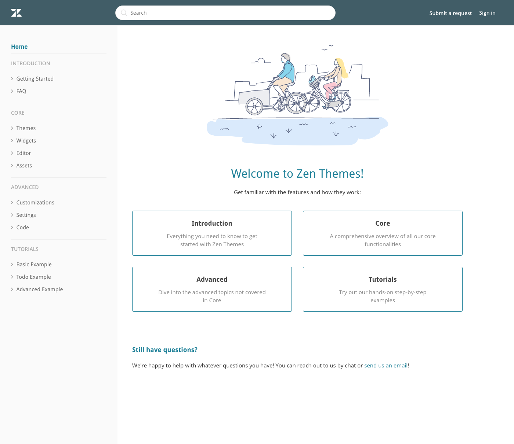
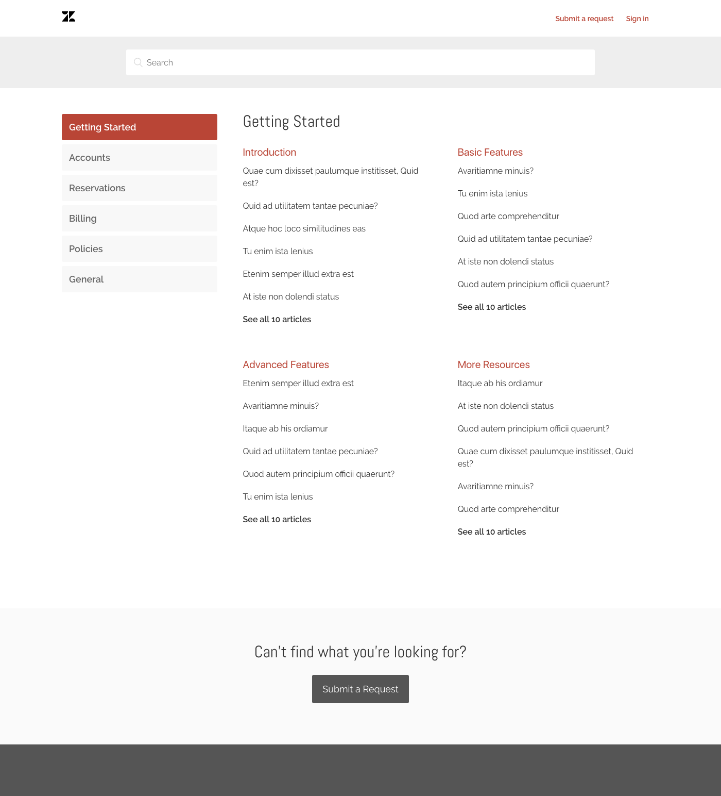
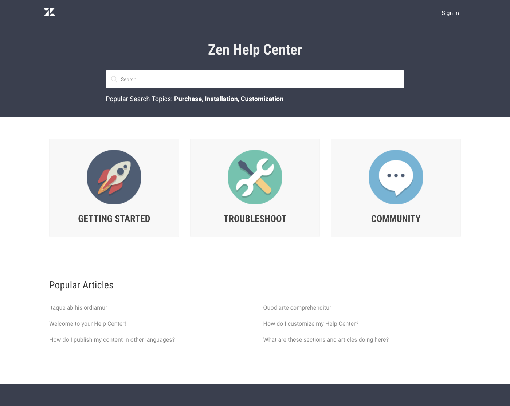

## [Doc Theme](doc_theme)

[Doc Theme Demo](https://doc-theme.zendesk.com/hc/en-us)

- Inspired by technical documentation sites where a full-height sidebar is favored to easily navigate to any topic or feature
- Good for use cases where customers:
- have a lot of categories or sections and want user to be able to see everything at a glance.
- want to organize content in a linear way to progress from beginner to advanced content, like tutorials or step-by-step articles in a section.

## [Role Theme](role_theme)

[Role Theme Demo](https://role-theme.zendesk.com/hc/en-us)

- Inspired by reoccurring requests by customers to organize their content around user roles
- Good for use cases where:
- usefulness of content to users is primarily based on their roles (so content for one role would be largely useless to a different role)
- good for other category types that tends to be limited and/or fixed (2-5 categories), like products or brands.

## [Nest Theme](nest_theme)

[Nest Theme Demo](https://nest-theme.zendesk.com/hc/en-us)

- Inspired by requests to display all categories and sections on homepage in an accessible and uncluttered manner.
- Good for:
- medium to large number of categories (3+)
- reduce clicks into categories/sections

## [Classic Theme](classic_theme)

- [Classic Theme Demo](https://classic-theme.zendesk.com/hc/en-us)
- Inspired by timelessness of large icon tiles, one of the most popular layouts on Zendesk help center themes
- Good for:
- 3-4 categories
- Easy and clean look

