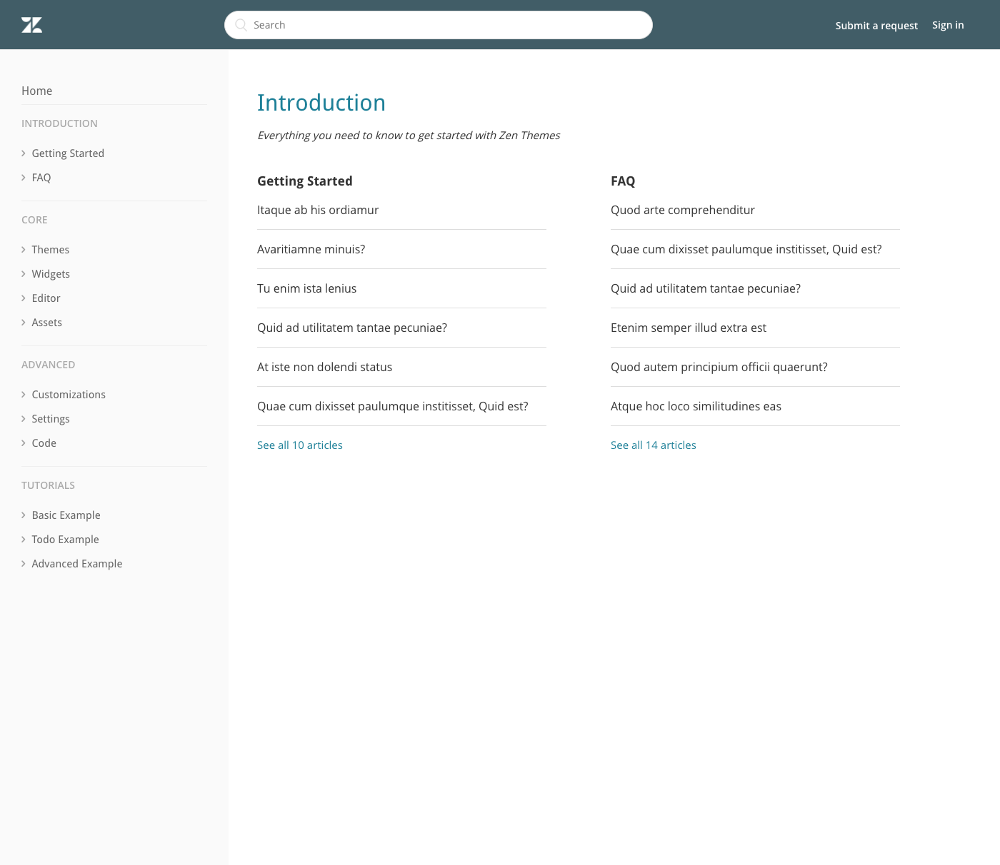
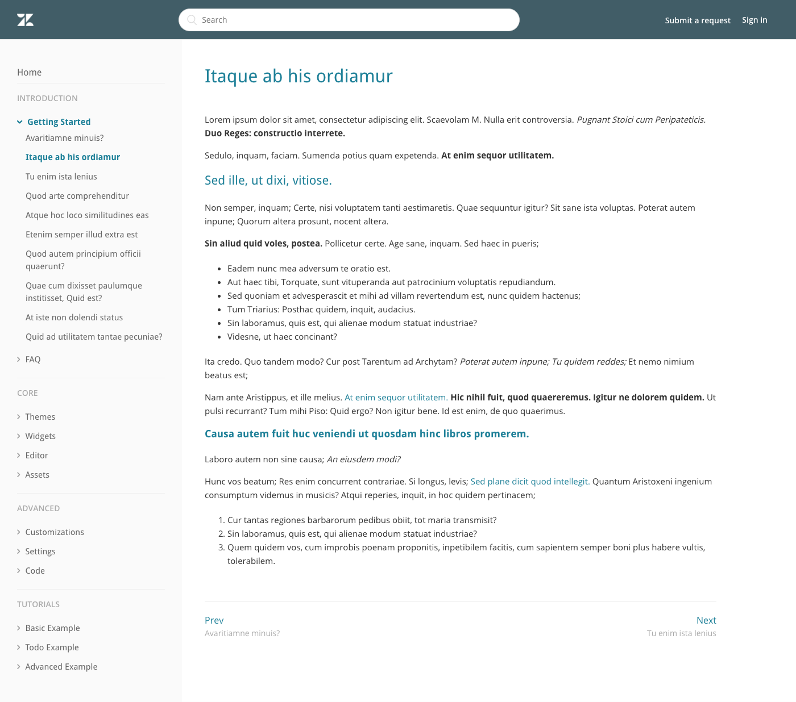

Doc Theme Demo](https://doc-theme.zendesk.com/hc/en-us)

- Inspired by technical documentation sites where a full-height sidebar is favored to easily navigate to any topic or feature
- Good for use cases where customers:
- have a lot of categories or sections and want user to be able to see everything at a glance.
- want to organize content in a linear way to progress from beginner to advanced content, like tutorials or step-by-step articles in a section.

### Home Page

### Category Page

### Article Page

